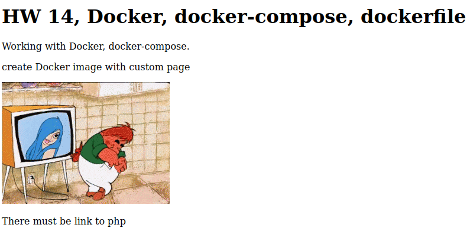

## Домашнее задание DOCKER
##### Задачи:
- Создайте свой кастомный образ nginx на базе alpine. После запуска nginx должен
отдавать кастомную страницу (достаточно изменить дефолтную страницу nginx)
- Определите разницу между контейнером и образом
Вывод опишите в домашнем задании.
- Ответьте на вопрос: Можно ли в контейнере собрать ядро?
- Собранный образ необходимо запушить в docker hub и дать ссылку на ваш репозиторий.
##### Задание со * (звездочкой)
- Создайте кастомные образы nginx и php, объедините их в docker-compose.
- После запуска nginx должен показывать php info.
- Все собранные образы должны быть в docker hub

##### 1. Основное задание
1.1 Создаем свой образ nginx на основе alpine
Поднимаем ВМ

    vagrant up
В процессе деплоя ВМ, будут выполнены роли:

    - hw14_0      # Prepare host
    - hw14_1    # Install Docker and create Docker user "Dock" 
    - hw14_2    # Install Docker-compose
    - hw14_3    # Prepare files for using docker
Заходим на ВМ и идем в папку /www

структура папки

    [root@hw14 www]# tree
    .
    ├── docker-compose.yml
    ├── Dockerfile
    ├── html
    │   ├── 404.html
    │   ├── 50x.html
    │   ├── index.html
    │   ├── karlsson-carlson.gif
    │   ├── karlsson.gif
    │   ├── nginx-logo.png
    │   └── poweredby.png
    ├── nginx
    │   └── nginx.conf
    └── php
    
    3 directories, 10 files
Создаем свой образ 

    docker build -t hw14 .
Пушим в Dockerhub

    docker tag hw14 nbthub/hw-docker:latest
    docker push nbthub/hw-docker:latest
Чистим образы и контейнеры 

    docker rm container
    docker rmi images
Разворачиваем с помощью docker из Dockerhub

    docker run -d --rm -p 8080:80 --name test nbthub/hw-docker
Контейнер запущен

    [root@hw14 ~]# docker ps
    CONTAINER ID   IMAGE              COMMAND                  CREATED          STATUS         PORTS     NAMES
    1d7f52da5eb0   nbthub/hw-docker   "nginx -g 'daemon of…"   10 seconds ago   Up 8 seconds   80/tcp    www-web-1
проверяем страницу, все ок:

    [root@hw14 ~]# curl 127.0.0.1:8080
    <!doctype html>
    
    <html>
    
    <head>
    
    <title>Where is Karson?</title>
    
    </head>
    
    <body>
    
    <h1>HW 14, Docker, docker-compose, dockerfile </h1>
    
    
Working with Docker, docker-compose.

    
    
create Docker image with custom page

    
    

    
    
There must be link to php

    
    
    </body>
    
    </html>
или в web-браузере http://192.168.11.101:8080

Можно поднять с помощью docker-compose

    [root@hw14 www]# docker-compose up
    [+] Running 5/5
     ⠿ web Pulled                                                5.9s
       ⠿ 59bf1c3509f3 Pull complete                              2.4s
       ⠿ 23e6c65a695e Pull complete                              2.8s
       ⠿ ae00d5627d1b Pull complete                              2.9s
       ⠿ ecd554c81c79 Pull complete                              3.0s
    [+] Running 2/2
     ⠿ Network www_default  Created                              0.2s
     ⠿ Container www-web-1  Created                              0.2s
    Attaching to www-web-1
Результат аналогичный

1.2 Разница между образом и контейнером
- образ (image) - это шаблон, изначальный незапущенный контейнер. может существовать в локальном или удаленном репозитории
- контейнер - это запущенный образ, существует пока работает.

1.3 Можно ли в контейнере собрать ядро?
Да можно, так как существуют образы с полноценными ОС. Только это задачи узкоспециализированные, когдя нужно свое ядро для запуска специфичного ПО.

1.4 Ссылка на Dockerhub
https://hub.docker.com/repository/docker/nbthub/hw-docker

##### 2. Задание со * (звездочкой)
не сделано, остановился на этапе монтирования папки к контейнеру

все время получаю ошибку 403