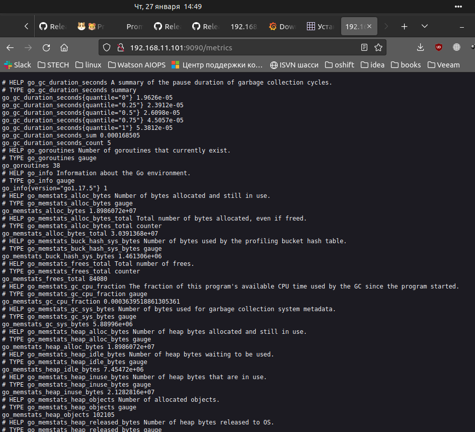
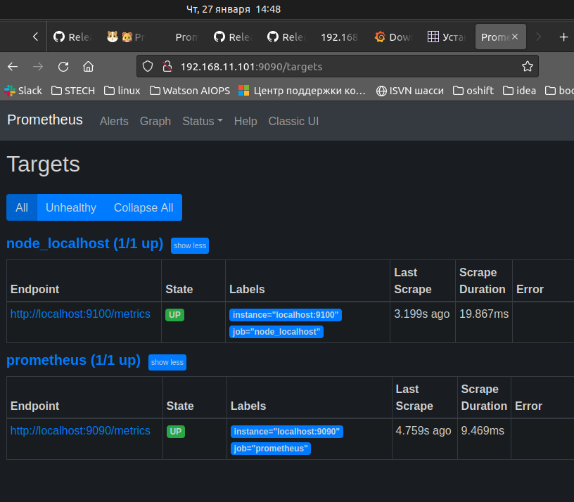

## Домашнее задание DOCKER
### Задачи:
Настройка мониторинга

Настроить дашборд с 4-мя графиками

- память;
- процессор;
- диск;
- сеть.

Настроить на одной из систем:

- zabbix (использовать screen (комплексный экран);
- prometheus - grafana.

### Задание со * (звездочкой)
- использование систем, примеры которых не рассматривались на занятии. Список возможных систем был приведен в презентации.

### 1. Основное задание
Поднимаем ВМ

    vagrant up
В процессе деплоя ВМ, будут выполнены роли:

    - hw15_0    # Prepare host
    - hw15_1    # Install Docker and create Docker user "Dock" 
    - hw15_2    # Install Docker-compose
    - hw15_3    # Deploy Prometheus-Grafana

Проверяем что работает node_exporter  
  

Проверяем что работает prometheus и в targets есть node_exporter  

Заходим в grafana **http://192.168.11.101:3000**  
Логинимся (admin:admin), добавляем источник, ждем и получаем в итоге:

##### 2. Задание со * (звездочкой)
не сделано.
