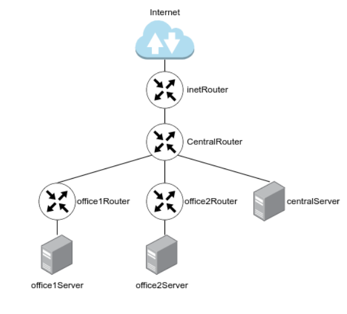

## ДЗ Архитектура сетей
##### Задачи:

1. Скачать и развернуть Vagrant-стенд
(https://github.com/erlong15/otus-linux/tree/network)
2. Построить следующую сетевую архитектуру:

Сеть office1
- 192.168.2.0/26 - dev
- 192.168.2.64/26 - test servers
- 192.168.2.128/26 - managers
- 192.168.2.192/26 - office hardware

Сеть office2
- 192.168.1.0/25 - dev
- 192.168.1.128/26 - test servers
- 192.168.1.192/26 - office hardware

Сеть central
- 192.168.0.0/28 - directors
- 192.168.0.32/28 - office hardware
- 192.168.0.64/26 - wifi

Итого должны получиться следующие сервера:
- inetRouter
- centralRouter
- office1Router
- office2Router
- centralServer
- office1Server
- office2Server

### Теоретическая часть
- Найти свободные подсети
- Посчитать сколько узлов в каждой подсети, включая свободные
- Указать broadcast адрес для каждой подсети
- проверить нет ли ошибок при разбиении

Сеть office1
|Название|Подсеть|Min IP|Max IP|Broadcast|Hosts|Mask|
|---|---|---|---|---|:---:|---|
|dev|192.168.2.0/26|192.168.2.1|192.168.2.62|192.168.2.63|62|255.255.255.192|
|test servers|192.168.2.64/26|192.168.2.65|192.168.2.126|192.168.2.127|62|255.255.255.192|
|managers|192.168.2.128/26|192.168.2.129|192.168.2.190|192.168.2.191|62|255.255.255.192|
|office hw|192.168.2.192/26|192.168.2.193|192.168.2.254|192.168.0.255|62|255.255.255.192|

`свободных подсетей` нет, `brodcast` указан в таблице

Сеть office2
|Название|Подсеть|Min IP|Max IP|Broadcast|Hosts|Mask|
|---|---|---|---|---|:---:|---|
|dev|192.168.1.0/25|192.168.1.1|192.168.1.126|192.168.1.128|126|255.255.255.128|
|test servers|192.168.1.128/26|192.168.1.129|192.168.1.190|192.168.1.191|62|255.255.255.192|
|office hw|192.168.1.192/26|192.168.1.193|192.168.1.254|192.168.1.255|62|255.255.255.192|

`свободных подсетей` нет, `brodcast` указан в таблице

Сеть Central

|Название|Подсеть|Min IP|Max IP|Broadcast|Hosts|Mask|
|---|---|---|---|---|:---:|---|
|directors|192.168.0.0/28|192.168.0.1|192.168.0.14|192.168.0.15|16|255.255.255.240|
|Office hw|192.168.0.32/28|192.168.0.33|192.168.0.46|192.168.0.47|16|255.255.255.240|
|wifi|192.168.0.64/26|192.168.0.65|192.168.0.126|192.168.0.127|62|255.255.255.192|

`свободные подсети`, `broadcast` указаны в таблицах. 

|Название подсети|Подсеть|Min IP|Max IP|Broadcast|Hosts|Mask|
|---|---|---|---|---|:---:|---|
|central|192.168.0.16/28|192.168.0.17|192.168.0.30|192.168.0.31|16|255.255.255.240|
|central|192.168.0.48/28|192.168.0.49|192.168.0.62|192.168.0.63|16|255.255.255.240|
|central|192.168.0.128/25|192.168.0.129|192.168.0.254|192.168.0.255|126|255.255.255.128|

в методичке также рассмотриваются подсети между `роутерами`

занятые
|Название подсети|Подсеть|Min IP|Max IP|Broadcast|Hosts|Mask|
|---|---|---|---|---|:---:|---|
|inetRouter-centralRouter|192.168.255.0/30|192.168.255.1|192.168.255.12|192.168.255.3|2|255.255.255.252|
|centralRouter-office2Router|192.168.255.4/30|192.168.255.5|192.168.255.6|192.168.255.7|2|255.255.255.252|
|centralRouter-office1Router|192.168.255.8/30|192.168.255.9|192.168.255.10|192.168.255.11|2|255.255.255.252|

свободные

|Название подсети|Подсеть|Min IP|Max IP|Broadcast|Hosts|Mask|
|---|---|---|---|---|:---:|---|
|free|192.168.255.12/30|192.168.255.13|192.168.255.14|192.168.255.15|2|255.255.255.252|
|free|192.168.255.16/28|192.168.255.17|192.168.255.30|192.168.255.31|14|255.255.255.240|
|free|192.168.255.32/27|192.168.255.33|192.168.255.62|192.168.255.63|30|255.255.255.224|
|free|192.168.255.64/26|192.168.255.65|192.168.255.126|192.168.255.127|62|255.255.255.192|
|free|192.168.255.128/25|192.168.255.129|192.168.255.254|192.168.255.255|126|255.255.255.128|

ошибок в разбиении нет

###  Практическая часть

Сделано по методичке.

Из интересного:

- необходимо удалить маршруты по умолчанию создаваемые Vagrant-ом. На каждой ОС своя технология.

Реализация. 

Vagrant + Ansible (для каждого сервера/роутера своя роль)

Проверка маршрута и пинг с серверов в интернет

- centralServer - inet

      [root@centralServer ~]# ip r
      default via 192.168.0.1 dev eth1 proto static metric 101 
      10.0.2.0/24 dev eth0 proto kernel scope link src 10.0.2.15 metric 100 
      192.168.0.0/28 dev eth1 proto kernel scope link src 192.168.0.2 metric 101 
      192.168.50.0/24 dev eth2 proto kernel scope link src 192.168.50.13 metric 102
      [root@centralServer ~]# ping 8.8.8.8 -c 2
      PING 8.8.8.8 (8.8.8.8) 56(84) bytes of data.
      64 bytes from 8.8.8.8: icmp_seq=1 ttl=59 time=19.8 ms
      64 bytes from 8.8.8.8: icmp_seq=2 ttl=59 time=22.0 ms

- office1 - inet

      root@office1Server:~# ip r
      default via 192.168.2.129 dev enp0s8 proto static 
      default via 10.0.2.2 dev enp0s3 proto dhcp src 10.0.2.15 metric 100 
      10.0.2.0/24 dev enp0s3 proto kernel scope link src 10.0.2.15 
      10.0.2.2 dev enp0s3 proto dhcp scope link src 10.0.2.15 metric 100 
      192.168.2.128/30 dev enp0s8 proto kernel scope link src 192.168.2.130 
      192.168.50.0/24 dev enp0s19 proto kernel scope link src 192.168.50.15 
      root@office1Server:~# ping 8.8.8.8 -c 2
      PING 8.8.8.8 (8.8.8.8) 56(84) bytes of data.
      64 bytes from 8.8.8.8: icmp_seq=1 ttl=57 time=19.9 ms
      64 bytes from 8.8.8.8: icmp_seq=2 ttl=57 time=23.2 ms

      --- 8.8.8.8 ping statistics ---
      2 packets transmitted, 2 received, 0% packet loss, time 1001ms
      rtt min/avg/max/mdev = 19.868/21.524/23.181/1.656 ms

- office2 - inet

      root@office2Server:~# ip r
      default via 192.168.1.1 dev eth1 onlink 
      10.0.2.0/24 dev eth0 proto kernel scope link src 10.0.2.15 
      192.168.1.0/25 dev eth1 proto kernel scope link src 192.168.1.2 
      192.168.50.0/24 dev eth2 proto kernel scope link src 192.168.50.17 
      root@office2Server:~# ping 8.8.8.8
      PING 8.8.8.8 (8.8.8.8) 56(84) bytes of data.
      64 bytes from 8.8.8.8: icmp_seq=2 ttl=57 time=21.5 ms
      64 bytes from 8.8.8.8: icmp_seq=3 ttl=57 time=21.1 ms

      --- 8.8.8.8 ping statistics ---
      2 packets transmitted, 2 received, 0% packet loss, time 1002ms
      rtt min/avg/max/mdev = 23.331/23.618/23.905/0.287 ms

Проверка маршрутов/связи с inetRouter наружу и до сервера в каждой подсети.

      [root@inetRouter ~]# ip r
      default via 10.0.2.2 dev eth0 proto dhcp metric 100 
      10.0.2.0/24 dev eth0 proto kernel scope link src 10.0.2.15 metric 100 
      192.168.0.0/24 via 192.168.255.2 dev eth1 proto static metric 101 
      192.168.1.0/24 via 192.168.255.2 dev eth1 proto static metric 101 
      192.168.2.0/24 via 192.168.255.2 dev eth1 proto static metric 101 
      192.168.50.0/24 dev eth2 proto kernel scope link src 192.168.50.11 metric 102 
      192.168.255.0/30 dev eth1 proto kernel scope link src 192.168.255.1 metric 101 
      192.168.255.6 via 192.168.255.2 dev eth1 proto static metric 101 
      192.168.255.10 via 192.168.255.2 dev eth1 proto static metric 101 
      
      [root@inetRouter ~]# ping 192.168.0.2 -c 2
      PING 192.168.0.2 (192.168.0.2) 56(84) bytes of data.
      64 bytes from 192.168.0.2: icmp_seq=1 ttl=63 time=1.19 ms
      64 bytes from 192.168.0.2: icmp_seq=2 ttl=63 time=1.51 ms

      --- 192.168.0.2 ping statistics ---
      2 packets transmitted, 2 received, 0% packet loss, time 1001ms
      rtt min/avg/max/mdev = 1.191/1.353/1.516/0.166 ms
      
      [root@inetRouter ~]# ping 192.168.1.2 -c 2
      PING 192.168.1.2 (192.168.1.2) 56(84) bytes of data.
      64 bytes from 192.168.1.2: icmp_seq=1 ttl=62 time=1.55 ms
      64 bytes from 192.168.1.2: icmp_seq=2 ttl=62 time=2.61 ms

      --- 192.168.1.2 ping statistics ---
      2 packets transmitted, 2 received, 0% packet loss, time 1002ms
      rtt min/avg/max/mdev = 1.558/2.088/2.619/0.532 ms
      
      [root@inetRouter ~]# ping 192.168.2.130 -c 2
      PING 192.168.2.130 (192.168.2.130) 56(84) bytes of data.
      64 bytes from 192.168.2.130: icmp_seq=1 ttl=62 time=1.97 ms
      64 bytes from 192.168.2.130: icmp_seq=2 ttl=62 time=1.67 ms

      --- 192.168.2.130 ping statistics ---
      2 packets transmitted, 2 received, 0% packet loss, time 1001ms
      rtt min/avg/max/mdev = 1.676/1.824/1.973/0.154 ms
