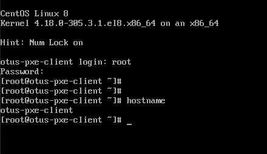

## ДЗ DHCP, PXE

##### Задачи:

1. Следуя шагам из документа https://docs.centos.org/en-US/8-docs/advanced-install/assembly_preparing-for-a-network-install установить и настроить загрузку по сети для дистрибутива CentOS8. 

      В качестве шаблона воспользуйтесь репозиторием https://github.com/nixuser/virtlab/tree/main/centos_pxe. 

2. Поменять установку из репозитория NFS на установку из репозитория HTTP.

3. Настроить автоматическую установку для созданного kickstart файла (*) Файл загружается по HTTP.

4. автоматизировать процесс установки Cobbler cледуя шагам из документа https://cobbler.github.io/quickstart/. 

Формат сдачи ДЗ - vagrant + ansible

#### Домашнее задание

1. Выполнено по методичке.

**Важно**:
- образ `CentOS-8.4.2105-x86_64-dvd1.iso` скачать в папку `files/`
- скачан с `https://mirror.sale-dedic.com/centos/8.4.2105/isos/x86_64/CentOS-8.4.2105-x86_6
4-dvd1.iso`

            files/
            ├── authorized_keys
            ├── CentOS-8.4.2105-x86_64-boot.iso
            ├── CentOS-8.4.2105-x86_64-dvd1.iso
            ├── result.png
            └── start.sh

2. в качестве web-server выбран Apache 
- в Apache добвлен раздел `centos8`, директория раздела `/iso/`, url `http://192.168.50.20/centos8/`

3. Файл kickstart перенесен без изменений.
- в нем ошибка и методичке указано `url —url=http://10.0.0.20/centos8/BaseOS/`, а нужно `url --url=http://10.0.0.20/centos8/BaseOS/`

4. данное задание не делал.

#### Результат выполнения
- ВМ pxeclient, при включении происходит автоматическая установка.
- логин `root` пароль `123`

