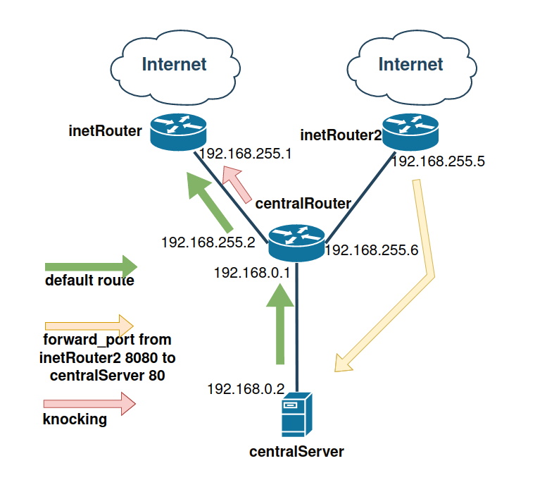

## ДЗ DHCP, PXE

#### Стенд 

1. - **реализовать knocking port**
   - **centralRouter может попасть на ssh inetrRouter через knock скрипт пример в материалах.**

- на `inetRouter` запущен `firewalld`.

      [root@inetRouter ~]# systemctl status firewalld.service 
      ● firewalld.service - firewalld - dynamic firewall daemon
        Loaded: loaded (/usr/lib/systemd/system/firewalld.service; enabled; vendor preset: enabled)
        Active: active (running) since Fri 2022-03-11 07:20:19 UTC; 1h 14min ago
          Docs: man:firewalld(1)
      Main PID: 397 (firewalld)
        CGroup: /system.slice/firewalld.service
                └─397 /usr/bin/python2 -Es /usr/sbin/firewalld --nofork --nopid

- настроены маршруты: по умолчанию и во внутреннюю сеть.

      [root@inetRouter ~]# ip r 
      default via 10.0.2.2 dev eth0 proto dhcp metric 100 
      10.0.2.0/24 dev eth0 proto kernel scope link src 10.0.2.15 metric 100 
      192.168.0.0/24 via 192.168.255.2 dev eth1 proto static metric 101 
      192.168.1.0/24 via 192.168.255.2 dev eth1 proto static metric 101 
      192.168.2.0/24 via 192.168.255.2 dev eth1 proto static metric 101 
      192.168.50.0/24 dev eth2 proto kernel scope link src 192.168.50.11 metric 102 
      192.168.255.0/30 dev eth1 proto kernel scope link src 192.168.255.1 metric 101 
      192.168.255.4/30 via 192.168.255.2 dev eth1 proto static metric 101 
      192.168.255.6 via 192.168.255.2 dev eth1 proto static metric 101 
      192.168.255.10 via 192.168.255.2 dev eth1 proto static metric 101 

- интерфейсы `eth0` (vagrant) и `eth2` (ansible) в зоне `external`, `ssh` разрешен, `masquerade` включен.

      [root@inetRouter ~]# firewall-cmd --zone=external --list-all 
      external (active)
        target: default
        icmp-block-inversion: no
        interfaces: eth0 eth2
        sources: 
        services: ssh
        ports: 
        protocols: 
        masquerade: yes
        forward-ports: 
        source-ports: 
        icmp-blocks: 
        rich rules: 
- интерфейс `eth1` (internal) в зоне public, запрещен `ssh` и открыты порты для knock `ports: 22322/udp 33433/tcp 44244/udp`, `masquerade` отключен.

        [root@inetRouter ~]# firewall-cmd --zone=public --list-all 
        public (active)
          target: default
          icmp-block-inversion: no
          interfaces: eth1
          sources: 
          services: dhcpv6-client
          ports: 22322/udp 33433/tcp 44244/udp
          protocols: 
          masquerade: no
          forward-ports: 
          source-ports: 
          icmp-blocks: 
          rich rules: 
- На `inetRouter` установлен и запущен `knockd-server`, слушающий на интерфейсе смотрящем во внутреннюю сеть `eth1`.

      [root@inetRouter ~]# systemctl status knockd.service 
      ● knockd.service - A port-knocking server
        Loaded: loaded (/usr/lib/systemd/system/knockd.service; enabled; vendor preset: disabled)
        Active: active (running) since Fri 2022-03-11 07:20:45 UTC; 52min ago
        Process: 1790 ExecStart=/usr/sbin/knockd -d $OPTIONS (code=exited, status=0/SUCCESS)
      Main PID: 1791 (knockd)
        CGroup: /system.slice/knockd.service
                └─1791 /usr/sbin/knockd -d -i eth1
- Для открытия нужно постучаться по портам в следующем порядке. `33433,22322:udp,44244:udp`
- Для закрытия `33433,22322:udp,44244:udp`.
- заходим на `centralRouter` и пробуем зайти по ssh на `inetRouter`.

      [root@centralRouter ~]# ssh day@192.168.255.1
      ssh: connect to host 192.168.255.1 port 22: No route to host
- стучимся (необходима установка `knock`), пользователь `day`, пароль `Otus2022` и пробуем зайти по ssh и `profit`

      [root@centralRouter ~]# ssh day@192.168.255.1
      ssh: connect to host 192.168.255.1 port 22: No route to host
      [root@centralRouter ~]# knock -v 192.168.255.1 33433 22322:udp 44244:udp
      hitting tcp 192.168.255.1:33433
      hitting udp 192.168.255.1:22322
      hitting udp 192.168.255.1:44244
      [root@centralRouter ~]# ssh day@192.168.255.1
      The authenticity of host '192.168.255.1 (192.168.255.1)' can't be established.
      ECDSA key fingerprint is SHA256:WKbtb/65Ewo0GmmZ3i4txo4A/++Df4qA5LQ9R4pygg4.
      ECDSA key fingerprint is MD5:72:07:09:a1:00:1c:73:cd:c7:97:f0:3a:f6:9c:fb:9a.
      Are you sure you want to continue connecting (yes/no)? yes
      Warning: Permanently added '192.168.255.1' (ECDSA) to the list of known hosts.
      day@192.168.255.1's password: 
- проверяем что на `inetRouter` порт открыт.

      [root@inetRouter ~]# firewall-cmd --zone=public --list-all 
      public (active)
        target: default
        icmp-block-inversion: no
        interfaces: eth1
        sources: 
        services: dhcpv6-client ssh
        ports: 22322/udp 33433/tcp 44244/udp
        protocols: 
        masquerade: no
        forward-ports: 
        source-ports: 
        icmp-blocks: 
        rich rules: 

- закрываем порт `ssh`

      [root@centralRouter ~]# knock -v 192.168.255.1 22322:udp 44244:udp 33433
- проверяем что порт закрылся

      [root@inetRouter ~]# firewall-cmd --zone=public --list-all 
      public (active)
        target: default
        icmp-block-inversion: no
        interfaces: eth1
        sources: 
        services: dhcpv6-client
        ports: 22322/udp 33433/tcp 44244/udp
        protocols: 
        masquerade: no
        forward-ports: 
        source-ports: 
        icmp-blocks: 
        rich rules: 

2. **добавить inetRouter2, который виден(маршрутизируется (host-only тип сети для виртуалки)) с хоста или форвардится порт через локалхост.**
3. **запустить nginx на centralServer.**
4. **пробросить 80й порт на inetRouter2 8080.**

##### **Данные 3 пункта можно объединить.**
- на `centralServer` установлен `nginx`.

      yum install -y nginx
- проверяем с `inetRouter`

      [root@inetRouter ~]# curl -I 192.168.0.2
      HTTP/1.1 200 OK
      Server: nginx/1.20.1
      Date: Fri, 11 Mar 2022 09:04:42 GMT
      Content-Type: text/html
      Content-Length: 4833
      Last-Modified: Fri, 16 May 2014 15:12:48 GMT
      Connection: keep-alive
      ETag: "53762af0-12e1"
      Accept-Ranges: bytes

- поднята ВМ аналогичная `InetRouter`
- на `inetRouter2` запущен `firewalld`.
- настроены маршруты: по умолчанию и во внутреннюю сеть.
- интерфейсы `eth0` (vagrant) и `eth2` (ansible) в зоне `external`, `ssh` разрешен, `masquerade` включен, сделан проброс.

      [root@inetRouter2 ~]# firewall-cmd  --zone=external --list-all
      external (active)
        target: default
        icmp-block-inversion: no
        interfaces: eth0 eth2
        sources: 
        services: ssh
        ports: 8080/tcp
        protocols: 
        masquerade: yes
        forward-ports: 
        source-ports: 
        icmp-blocks: 
        rich rules: 
      	rule family="ipv4" forward-port port="8080" protocol="tcp" to-port="80" to-addr="192.168.0.2"

- интерфейс `eth1` (internal) в зоне public, запрещен `ssh` и открыт порт для nginx `ports: 8080/tcp`, `masquerade` включен.

      [root@inetRouter2 ~]# firewall-cmd  --zone=public --list-all
      public (active)
        target: default
        icmp-block-inversion: no
        interfaces: eth1
        sources: 
        services: dhcpv6-client ssh
        ports: 
        protocols: 
        masquerade: yes
        forward-ports: 
        source-ports: 
        icmp-blocks: 
        rich rules: 

- проверяем с хостовой машины (на которой крутится virtualbox)

      nbt@lenovo:~/otus/hw20$ curl -I 192.168.50.14:8080
      HTTP/1.1 200 OK
      Server: nginx/1.20.1
      Date: Fri, 11 Mar 2022 09:12:43 GMT
      Content-Type: text/html
      Content-Length: 4833
      Last-Modified: Fri, 16 May 2014 15:12:48 GMT
      Connection: keep-alive
      ETag: "53762af0-12e1"
      Accept-Ranges: bytes

5. **дефолт в инет оставить через inetRouter.** 
Тут просто делаем ``traceroute` с `centralServer`.

        [root@centralServer ~]# traceroute 8.8.8.8
        traceroute to 8.8.8.8 (8.8.8.8), 30 hops max, 60 byte packets
        1  gateway (192.168.0.1)  0.851 ms  0.785 ms  0.744 ms
        2  192.168.255.1 (192.168.255.1)  1.308 ms  1.262 ms  1.222 ms
        3  * * *
        4  * * *
        5  * * *
        6  dns.google (8.8.8.8)  6.511 ms  4.649 ms  4.571 ms

##### Формат сдачи ДЗ - vagrant + ansible
##### ***  реализовать проход на 80й порт без маскарадинга (не сделано)
