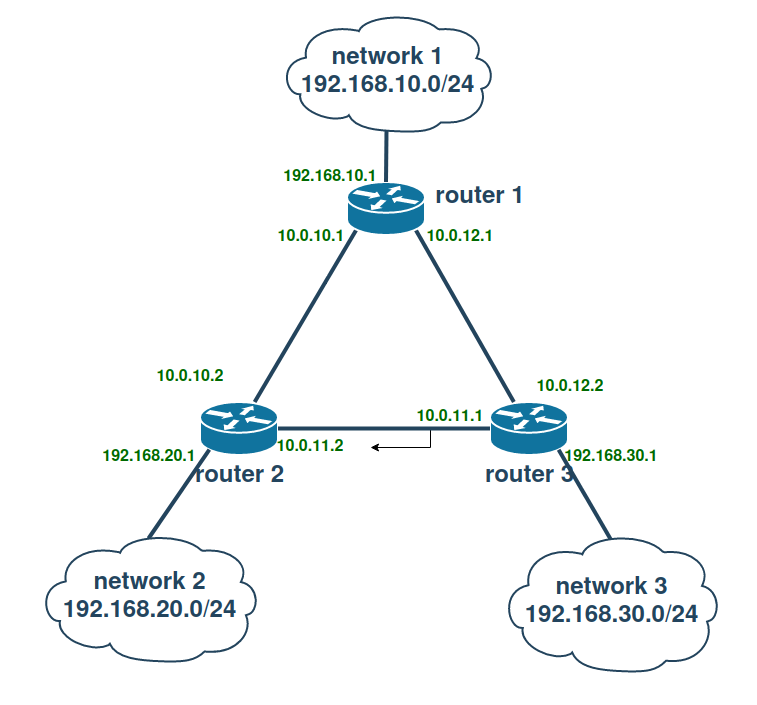

## ДЗ Статическая и динамическая маршрутизация, OSPF

#### Стенд 

#### 1. Поднять три виртуалки

- **Важно!!! В данном ДЗ ВМ поднимаются без провизижна ansible!!!**

      vagrant up

#### 2. Объединить их разными vlan. 
Все сделано по методичке.

2.1 поднять OSPF между машинами на базе Quagga;

запускаем плэйбук для настройки всех машин.

      ansible-playbook playbooks/default.yml 

- проверяем маршруты:
    - на `router1`

          root@router1:~# ip r
          10.0.2.0/24 dev enp0s3 proto kernel scope link src 10.0.2.15 
          10.0.2.2 dev enp0s3 proto dhcp scope link src 10.0.2.15 metric 100 
          10.0.10.0/30 dev enp0s8 proto kernel scope link src 10.0.10.1 
          10.0.11.0/30 nhid 32 proto ospf metric 20 
	          nexthop via 10.0.10.2 dev enp0s8 weight 1 
	          nexthop via 10.0.12.2 dev enp0s9 weight 1 
          10.0.12.0/30 dev enp0s9 proto kernel scope link src 10.0.12.1 
          192.168.10.0/24 dev enp0s10 proto kernel scope link src 192.168.10.1 
          192.168.20.0/24 nhid 33 via 10.0.10.2 dev enp0s8 proto ospf metric 20 
          192.168.30.0/24 nhid 34 via 10.0.12.2 dev enp0s9 proto ospf metric 20 
          192.168.50.0/24 dev enp0s16 proto kernel scope link src 192.168.50.10 
    - на `router2`

          root@router2:~# ip r
          10.0.2.0/24 dev enp0s3 proto kernel scope link src 10.0.2.15 
          10.0.2.2 dev enp0s3 proto dhcp scope link src 10.0.2.15 metric 100 
          10.0.10.0/30 dev enp0s8 proto kernel scope link src 10.0.10.2 
          10.0.11.0/30 dev enp0s9 proto kernel scope link src 10.0.11.2 
          10.0.12.0/30 nhid 41 proto ospf metric 20 
	          nexthop via 10.0.11.1 dev enp0s9 weight 1 
	          nexthop via 10.0.10.1 dev enp0s8 weight 1 
          192.168.10.0/24 nhid 42 via 10.0.10.1 dev enp0s8 proto ospf metric 20 
          192.168.20.0/24 dev enp0s10 proto kernel scope link src 192.168.20.1 
          192.168.30.0/24 nhid 34 via 10.0.11.1 dev enp0s9 proto ospf metric 20 
          192.168.50.0/24 dev enp0s16 proto kernel scope link src 192.168.50.11 
    - на `router3`

          root@router3:~# ip r
          10.0.2.0/24 dev enp0s3 proto kernel scope link src 10.0.2.15 
          10.0.2.2 dev enp0s3 proto dhcp scope link src 10.0.2.15 metric 100 
          10.0.10.0/30 nhid 55 proto ospf metric 20 
	          nexthop via 10.0.11.2 dev enp0s8 weight 1 
	          nexthop via 10.0.12.1 dev enp0s9 weight 1 
          10.0.11.0/30 dev enp0s8 proto kernel scope link src 10.0.11.1 
          10.0.12.0/30 dev enp0s9 proto kernel scope link src 10.0.12.2 
          192.168.10.0/24 nhid 56 via 10.0.12.1 dev enp0s9 proto ospf metric 20 
          192.168.20.0/24 nhid 50 via 10.0.11.2 dev enp0s8 proto ospf metric 20 
          192.168.30.0/24 dev enp0s10 proto kernel scope link src 192.168.30.1 
          192.168.50.0/24 dev enp0s16 proto kernel scope link src 192.168.50.12 

    - на `router1` запускаем пинг сети за `router2`.

          root@router1:~# ping -I 192.168.10.1 192.168.20.1
          PING 192.168.20.1 (192.168.20.1) from 192.168.10.1 : 56(84) bytes of data.
          64 bytes from 192.168.20.1: icmp_seq=1 ttl=64 time=0.679 ms

    - на `router2` отслеживаем отслеживаем интерфейс смотрящий в сторону `router1`.

          root@router2:~# tcpdump -i enp0s8
          tcpdump: verbose output suppressed, use -v or -vv for full protocol decode
          listening on enp0s8, link-type EN10MB (Ethernet), capture size 262144 bytes
          13:03:26.794658 IP 10.0.10.1 > ospf-all.mcast.net: OSPFv2, Hello, length 48
          13:03:29.165643 IP 192.168.10.1 > router2: ICMP echo request, id 12, seq 1, length 64
          13:03:29.165691 IP router2 > 192.168.10.1: ICMP echo reply, id 12, seq 1, length 64
          13:03:30.183154 IP 192.168.10.1 > router2: ICMP echo request, id 12, seq 2, length 64
          13:03:30.183216 IP router2 > 192.168.10.1: ICMP echo reply, id 12, seq 2, length 64
          13:03:30.772028 IP router2 > ospf-all.mcast.net: OSPFv2, Hello, length 48
          13:03:31.207087 IP 192.168.10.1 > router2: ICMP echo request, id 12, seq 3, length 64
          13:03:31.207144 IP router2 > 192.168.10.1: ICMP echo reply, id 12, seq 3, length 64
`Все OK, обмен маршрутами через ospf настроен.`

2.2 изобразить ассиметричный роутинг;

- для этого на `router1` меняем вес маршрута для интерфейса смотрящего в сторону `router2`.
    - выполняем `ansible-playbook playbooks/asymmetric.yml`
    - запускаем пинг на `router1`

          root@router1:~# ping -I 192.168.10.1 192.168.20.1
          PING 192.168.20.1 (192.168.20.1) from 192.168.10.1 : 56(84) bytes of data.
          64 bytes from 192.168.20.1: icmp_seq=1 ttl=64 time=0.679 ms
          64 bytes from 192.168.20.1: icmp_seq=2 ttl=64 time=0.783 ms
          64 bytes from 192.168.20.1: icmp_seq=3 ttl=64 time=0.898 ms

  - опять смотрим на `router2` на `enp0s8`, видим, только ответы.

          root@router2:~# tcpdump -i enp0s8
          tcpdump: verbose output suppressed, use -v or -vv for full protocol decode
          listening on enp0s8, link-type EN10MB (Ethernet), capture size 262144 bytes
          13:14:49.444861 IP router2 > 192.168.10.1: ICMP echo reply, id 14, seq 3, length 64
          13:14:50.450355 IP router2 > 192.168.10.1: ICMP echo reply, id 14, seq 4, length 64

  - опять смотрим на `router2` на `enp0s9`, видим, только запросы.

          root@router2:~# tcpdump -i enp0s9
          tcpdump: verbose output suppressed, use -v or -vv for full protocol decode
          listening on enp0s9, link-type EN10MB (Ethernet), capture size 262144 bytes
          13:16:36.873923 IP 192.168.10.1 > router2: ICMP echo request, id 15, seq 5, length 64
          13:16:37.875495 IP 192.168.10.1 > router2: ICMP echo request, id 15, seq 6, length 64
`Т.Е запросы приходять через enp0s9, а уходят через enp0s8 - Асиметричный роутинг настроен!!!`

2.3. сделать один из линков "дорогим", но что бы при этом роутинг был симметричным.
- выполняем `ansible-playbook playbooks/symmetric.yml`.
    - запускаем пинг на `router1`

          root@router1:~# ping -I 192.168.10.1 192.168.20.1
          PING 192.168.20.1 (192.168.20.1) from 192.168.10.1 : 56(84) bytes of data.
          64 bytes from 192.168.20.1: icmp_seq=1 ttl=64 time=0.679 ms
          64 bytes from 192.168.20.1: icmp_seq=2 ttl=64 time=0.783 ms
          64 bytes from 192.168.20.1: icmp_seq=3 ttl=64 time=0.898 ms

    - на `router2` отслеживаем `enp0s8`

          root@router2:~# tcpdump -i enp0s8
          tcpdump: verbose output suppressed, use -v or -vv for full protocol decode
          listening on enp0s8, link-type EN10MB (Ethernet), capture size 262144 bytes
          13:27:41.342883 IP router2 > ospf-all.mcast.net: OSPFv2, Hello, length 48
          13:27:41.345736 IP router2 > ospf-all.mcast.net: OSPFv2, LS-Update, length 88
          13:27:41.937290 IP 10.0.10.1 > ospf-all.mcast.net: OSPFv2, LS-Ack, length 44
          13:27:42.583352 IP 10.0.10.1 > ospf-all.mcast.net: OSPFv2, Hello, length 48

    - на `router2` отслеживаем `enp0s9`.

          root@router2:~# tcpdump -i enp0s9
          tcpdump: verbose output suppressed, use -v or -vv for full protocol decode
          listening on enp0s9, link-type EN10MB (Ethernet), capture size 262144 bytes
          13:29:29.622203 IP 192.168.10.1 > router2: ICMP echo request, id 16, seq 111, length 64
          13:29:29.622264 IP router2 > 192.168.10.1: ICMP echo reply, id 16, seq 111, length 64
          13:29:29.779847 ARP, Request who-has 10.0.11.1 tell router2, length 28
          13:29:29.780833 ARP, Reply 10.0.11.1 is-at 08:00:27:e9:36:2a (oui Unknown), length 46
          13:29:30.624391 IP 192.168.10.1 > router2: ICMP echo request, id 16, seq 112, length 64
          13:29:30.624460 IP router2 > 192.168.10.1: ICMP echo reply, id 16, seq 112, length 64
          13:29:31.408856 IP router2 > ospf-all.mcast.net: OSPFv2, Hello, length 48
          13:29:31.626232 IP 192.168.10.1 > router2: ICMP echo request, id 16, seq 113, length 64
          13:29:31.626292 IP router2 > 192.168.10.1: ICMP echo reply, id 16, seq 113, length 64
Наблюдаем что через `enp0s9`(смотрит в сторону router3) идут и запросы и ответы.
`Таким образом, мы видим, что роутинг настроен через router3 - Симметричный роутинг настроен`

##### Формат сдачи ДЗ - vagrant + ansible
`ВАЖНО!!! автоматический провизионинг ansible при развертывании Vagrant отключен.`
