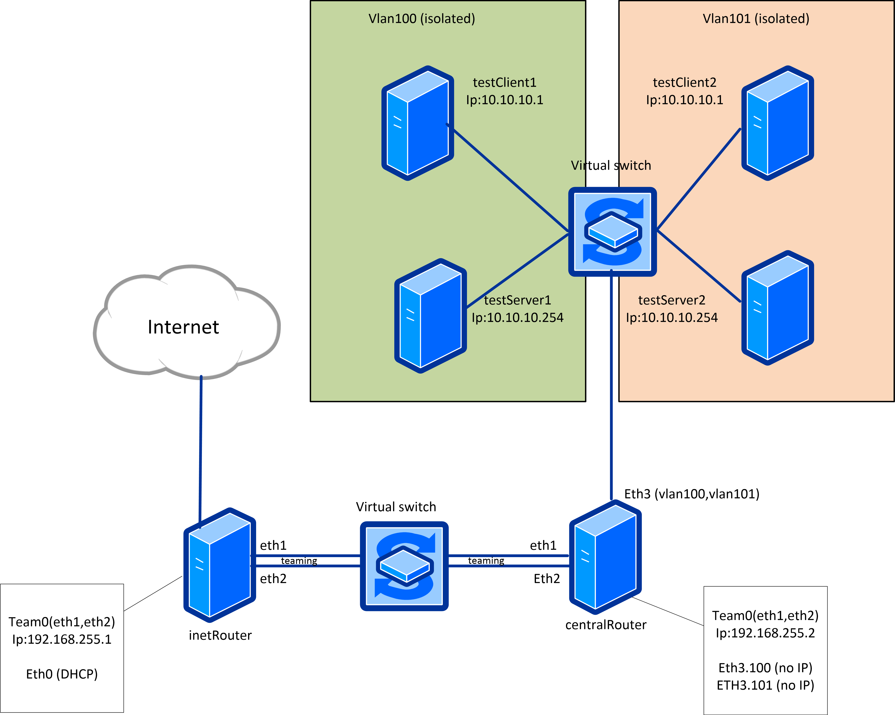

# ДЗ Сетевые пакеты. VLAN'ы. LACP.
### Задачи:
В Office1 в тестовой подсети появляется сервера с доп интерфесами и адресами. 

В internal сети testLAN

- testClient1 - 10.10.10.254
- testClient2 - 10.10.10.254
- testServer1- 10.10.10.1
- testServer2- 10.10.10.1 

развести вланами: 
- testClient1 <-> testServer1 
- testClient2 <-> testServer2 
- между centralRouter и inetRouter "пробросить" 2 линка (общая inernal сеть) и объединить их в бонд проверить работу c отключением интерфейсов 

Формат сдачи ДЗ - vagrant + ansible

#### Стенд

- inetRouter
    - virtual interface - `bond0`
        - interface - `eth1`
        - interface - `eth2`
        - ip - `192.168.255.1/24`
- testClient1
    - virtual interface - `bond0`
        - interface - `eth1`
        - interface - `eth1`
        - ip - `192.168.255.2/24`
- testClient1
    - interface - `eth1`
        - subinterface - `vlan100`
            - ip - `10.10.10.254/24`
- testClient2
    - interface - `eth1`
        - subinterface - `vlan101`
            - ip - `10.10.10.254/24`
- testServer1
    - interface - `eth1`
        - subinterface - `vlan100`
            - ip - `10.10.10.1/24`
- testServer2
    - interface - `eth1`
        - subinterface - `vlan101`
            - ip - `10.10.10.1/24`

#### Bonding (LACP,TEAMING)

поднимаем стенд - `vagrant up`

`тестируем`

  
bond0

    
 

Vlan раелизован конфигурированием интерфейсов `ifcfg-*`

- `vlan 100`

  
vlan100

    
 

- `vlan 101`

  
vlan101

    
 

 