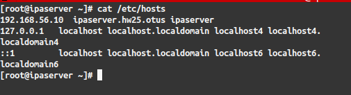
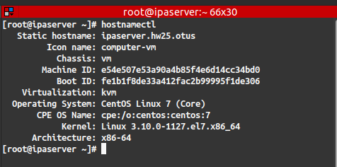
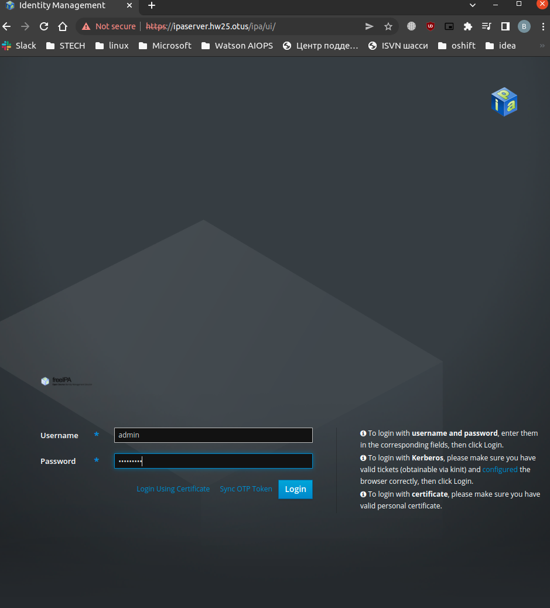
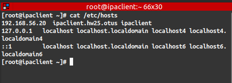
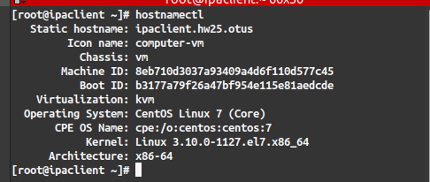
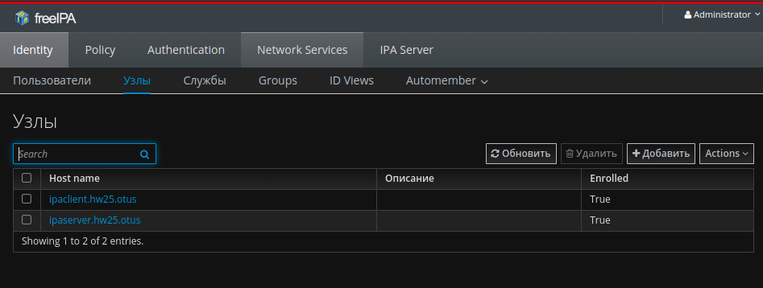
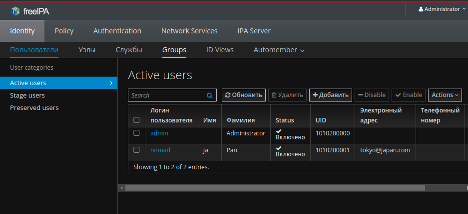
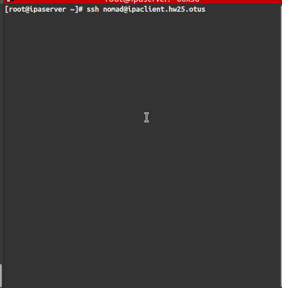

# LDAP. Централизованная авторизация и аутентификация 
### Задачи:
1. Установить FreeIPA;
2. Написать Ansible playbook для конфигурации клиента; 
3. задание с * Настроить аутентификацию по SSH-ключам; 
4. задание с ** Firewall должен быть включен на сервере и на клиенте. Формат сдачи ДЗ - vagrant + ansible

#### Стенд
- на своем хосте в /etc/hosts добавляем запись о нашем будущем сервере IPA `192.168.56.10 ipaserver.hw25.otus`

- `ipaserver`
    ip: 192.168.56.10
    cpu: 2
    RAM: 2048
- `ipaclient`
    ip: 192.168.56.20
    cpu: 1
    RAM: 256
- пароль для `admin` на `IPA-server` - `Secret123`
- пароль для создаваемого пользователя `nomad` - `Secret123`
- будущий домен `hw25.otus`

#### установить FreeIPA-server
1. правим hostname и файл hosts
    - `hostnamectl set-hostname ipaserver.hw25.otus`

  
cat /etc/hosts

    

  
ipserver hostnamectl

    

2. Запускаем/конфигурируем `firewalld`
    - `systemctl start firewalld`
    - открываем нужные порты/сервисы
        - `firewall-cmd --add-(port/service)=389/udp --permanent`
        - список портов/сервисов `http`, `https`, `389/tcp`, `88/tcp`, `464/tcp`, `464/udp`, `123,udp`.
    - применяем изменения
        - `firewall-cmd --reload`

3. устанавливаем `IPA-server`
    - `yum install -y  freeipa-server bind bind-dyndb-ldap`
4. обновляем необходимые утилиты
    - `yum update nss* -y`
5. инициализируем `IPA-server`
    - `ipa-server-install -a Secret123 --hostname=ipaserver.hw25.otus --realm HW25.OTUS -n hw25.otus -p Secret123 -n hw25.otus -U`
6. Старуем и добавляем в автозагрузку сервис IPA
    - `systemctl enable ipa.service`
	- `systemctl start ipa.service`
7. После этого мы можем авторизоваться в web-консоли IPA-server.
    - url - `https://ipaserver.hw25.otus`
    - логин и пароль есть в разделе `Стенд`

  
WEB console

    

#### установить FreeIPA-client и добавить в "домен".
1. правим файл hosts
    - `hostnamectl set-hostname ipaserver.hw25.otus`

  
cat /etc/hosts

    

2. устанавливаем `ipa-client`
    - `yum install -y ipa-client`
3. добавляем сервер в "домен"
    - `ipa-client-install -U -p admin -w Secret123 --server=ipaserver.hw25.otus --ip-address=192.168.56.10 --domain=hw25.otus --realm=HW25.OTUS --hostname=ipaclient.hw25.otus --mkhomedir`
4. после добавления hostname изменился на `ipaclient.hw25.otus`

  
ipclient hostnamectl

    

5. Можно проверить что хост добавился в web-console

  
ipserver-web-hosts

    

#### Написать Ansible playbook для конфигурации клиента; 

1. Пароль для `администратора IPA`  и `пользователя nomad` используем один и тот же и задаем в файле `/root/nomad`

2. на сервере IPA инициализируем `администратора`
    - `cat /root/nomad | kinit admin `
3. на сервере IPA создаем пользователя `nomad`
    - `cat /root/nomad | ipa user-add --first=Ja --last=Pan --cn=Japan --email=tokyo@japan.com --password --shell=/bin/bash --user-auth-type=password nomad`
4. Проверяем что пользователь создался.

  
web-console - Users

    

5. Пробуем залогиниться c `server` на хосте `ipaclient`

  
ssh nomad@ipaclient.hw25.otus

    

#### Авторизацию по ssh ключам не делал.
#### Selinux не отключал, все работает при включенном Selinux. 