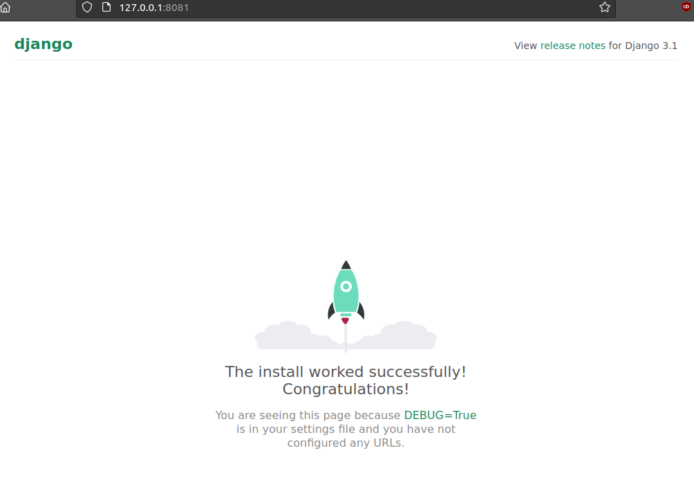

# Диманический веб
### Задачи:
Варианты стенда:
- nginx + php-fpm (laravel/wordpress) + python (flask/django) + js(react/angular);
- nginx + java (tomcat/jetty/netty) + go + ruby;
- можно свои комбинации. Реализации на выбор:
- на хостовой системе через конфиги в /etc;
- деплой через docker-compose. Для усложнения можно попросить проекты у коллег с курсов по разработке К сдаче принимается:
- vagrant стэнд с проброшенными на локалхост портами
- каждый порт на свой сайт
- через нжинкс Формат сдачи ДЗ - vagrant + ansible

#### Стенд
- nginx + php-fpm (laravel/wordpress) + python (flask/django) + js(react/angular); 
- Сделано по методичке. даже ждобавить нечего. 
- пытался сделать сам на Centos 7
    - там нужно дополнительно разрешать в selinux:
    
            setsebool -P httpd_can_network_connect on

#### Проверка

  
DJANGO - 8081

    

  
NODE.JS - 8082

    

  
WORDPRESS - 8083

    

