#   Загрузка Linux   # 

##   Часть 1   ##

###   Цель войти в систему без пароля и сбросить пароль root ###
####   1.1 init=/bin/sh .
    Для выполнения пришлось поднять ВМ с Debian, использовался.Vagrantfile_debian10.
<<<<<<< HEAD
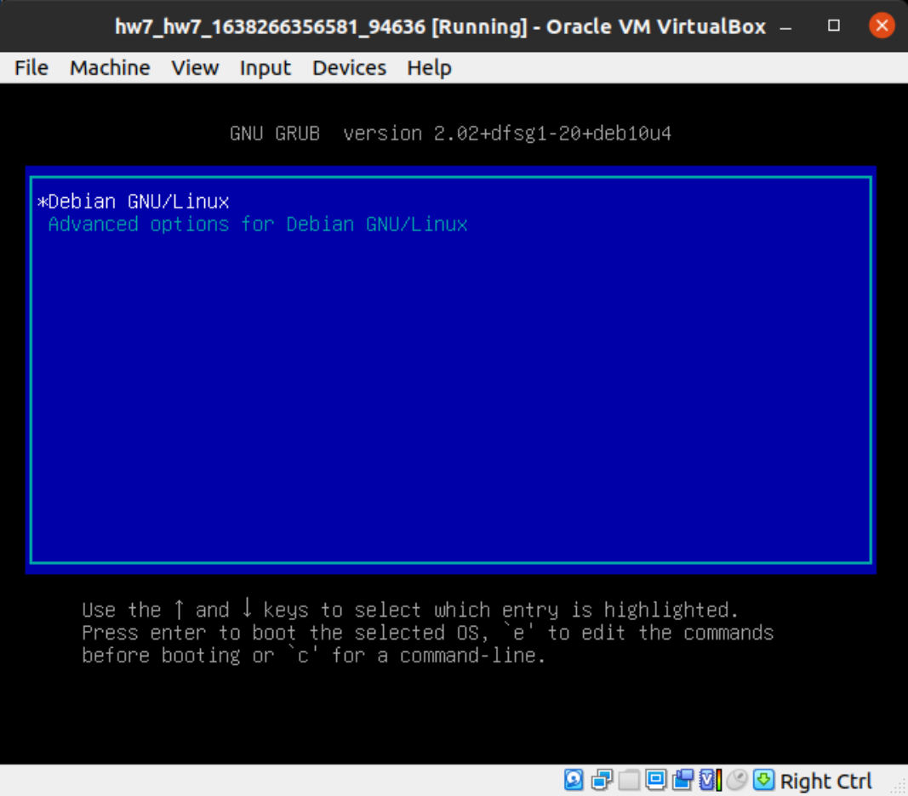 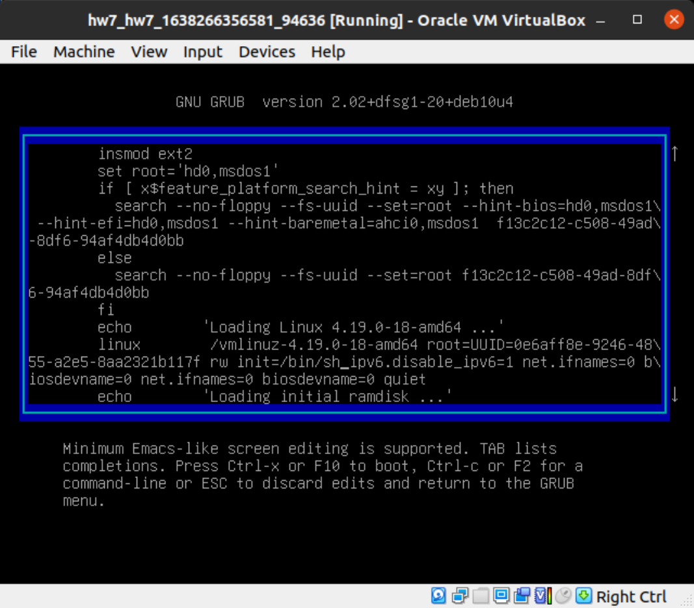    
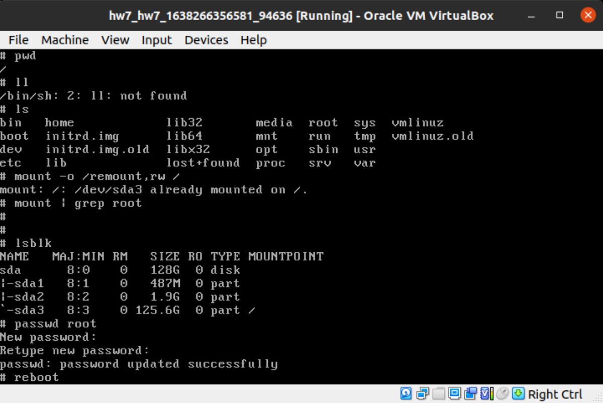 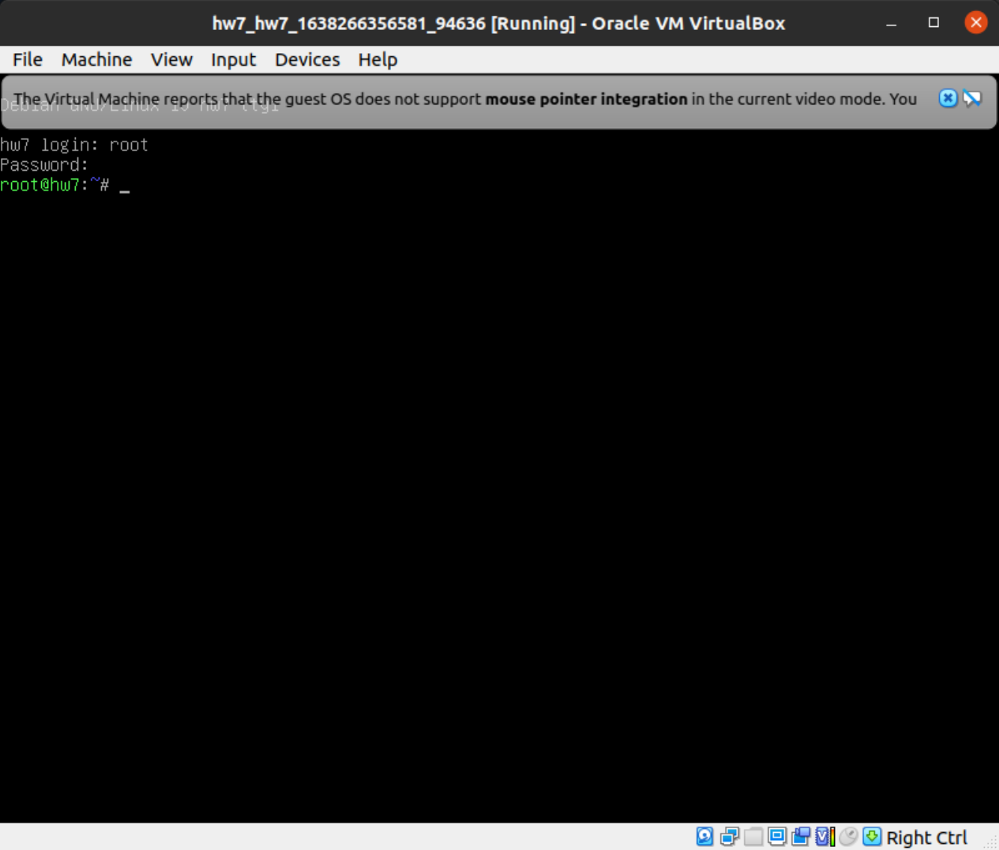

####   1.2 rd.break
    Для выполнения развернял ВМ Centos7 из iso-образа
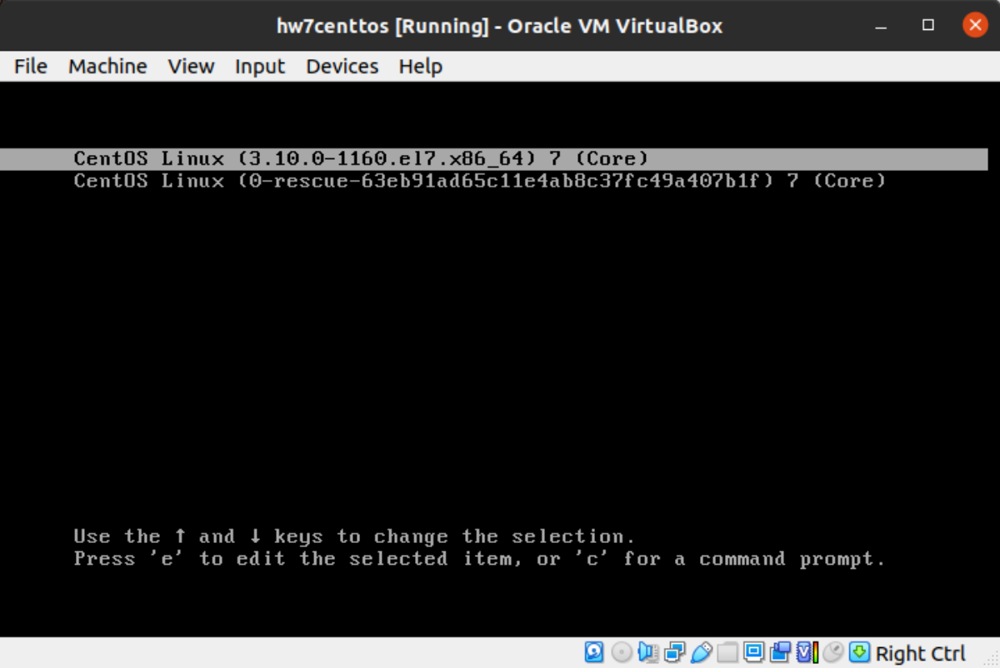 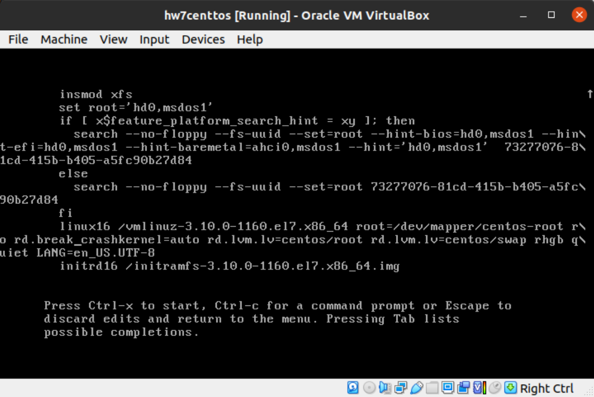    
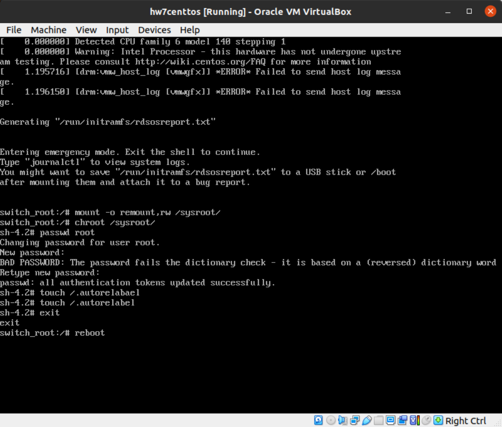 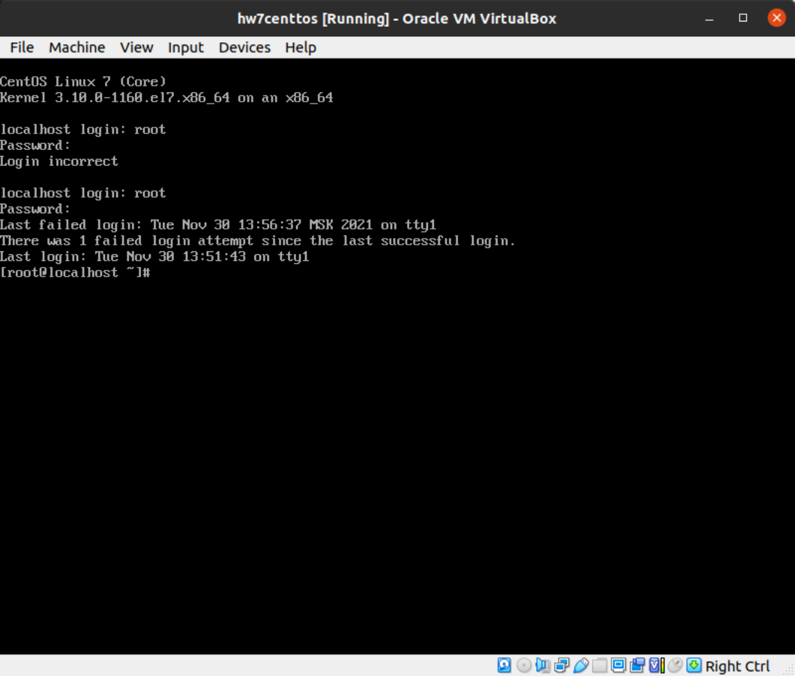
####  1.3 /sysroot/bin/sh
    Продолжил использовать ВМ из пункта 1.2
 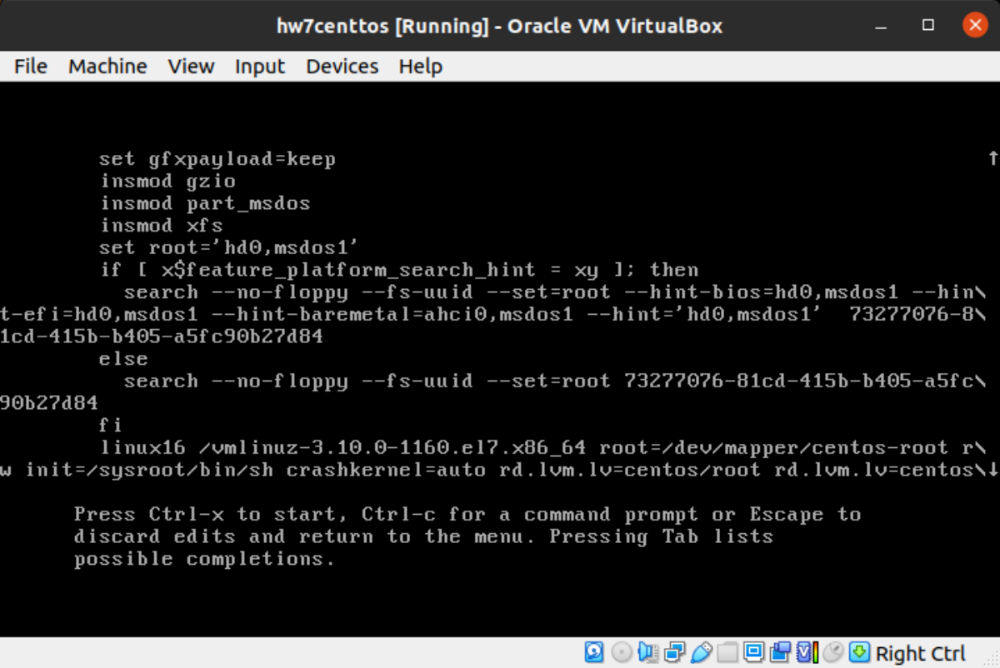    
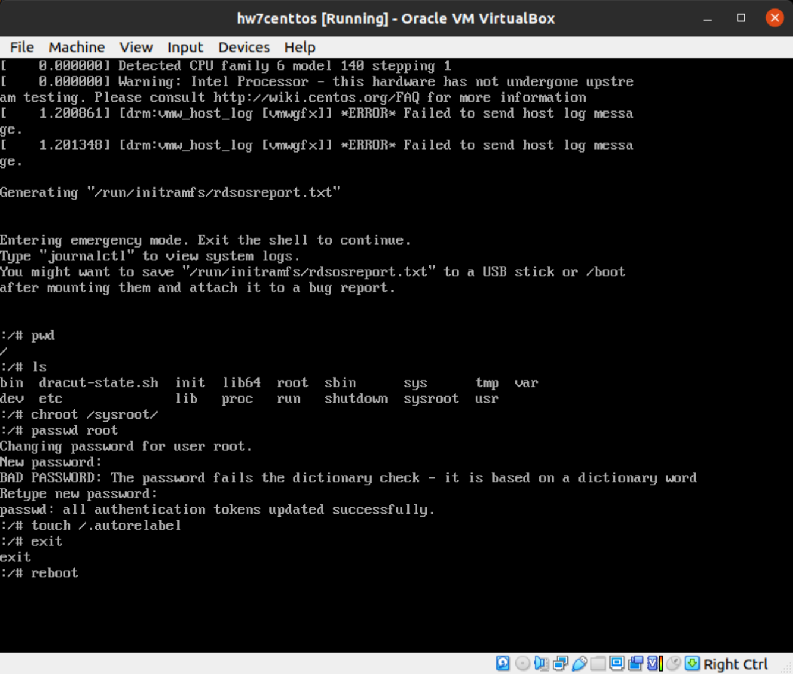 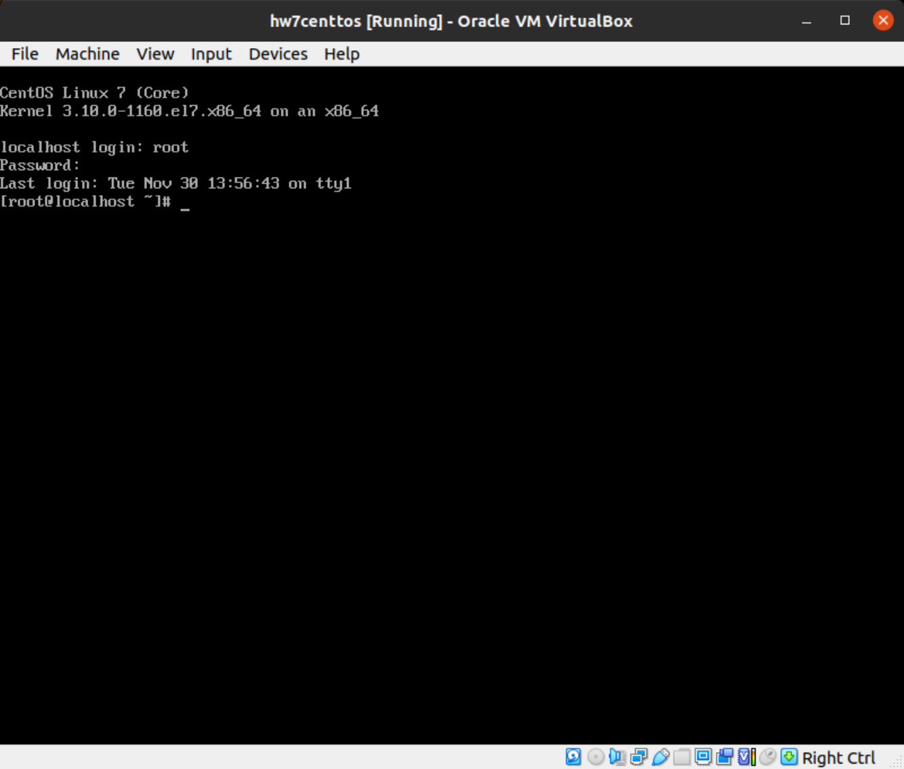

##   Часть 2     ##

    Для выполнения поднимал ВМ с помощью Vagrantfile (из ДЗ по lvm).
    Тут все прошло гладко. 
    Результат в файле hw7_part2

##   Часть 3     ##

    Для выполнения поднимал ВМ с помощью Vagrantfile (из ДЗ по lvm).
    Аналогично Части 2. 
    Результат в файле hw7_part3
